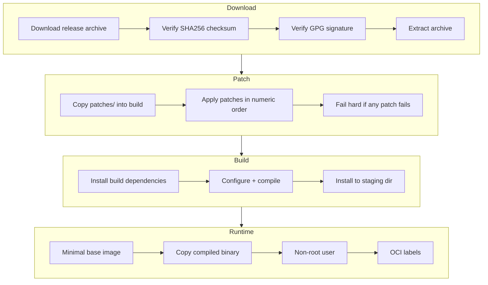

# Build Pipeline

## Overview

The build pipeline compiles upstream FOSS projects from official release archives with
security patches applied before compilation.



## Dockerfiles

| File | Language | Base Image |
|---|---|---|
| `Dockerfile` | C/C++/generic | Ubuntu 22.04 |
| `Dockerfile.go` | Go | golang + distroless |
| `Dockerfile.binary` | Any (pre-built) | Ubuntu 22.04 |

## Build Strategy Toggle

```bash
# Source build (default)
BUILD_STRATEGY=source ./build.sh

# Binary fallback
BUILD_STRATEGY=binary ./build.sh
```

The `BUILD_STRATEGY` variable controls CI, local builds, and Helm deployments consistently.
