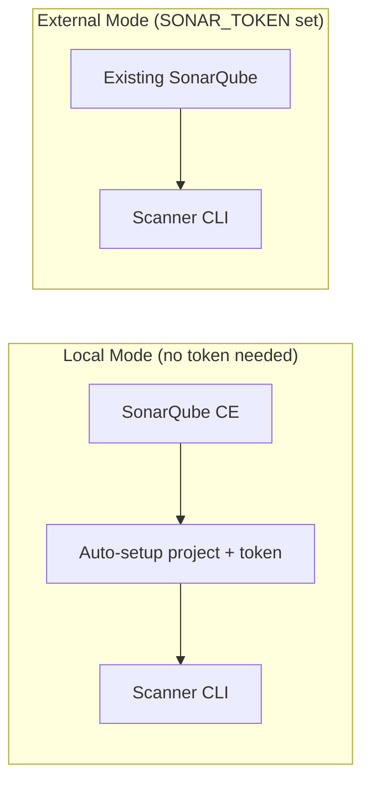

# Security Scanning

## Scanner Stack

All scanners run via Docker Compose with pinned versions (`.cicd/scan-versions.env`).

| Scanner | Type | What It Checks |
|---|---|---|
| Trivy | CVE | Container image vulnerabilities |
| Semgrep | SAST | Source code security patterns |
| SonarQube | SAST | Code quality + security hotspots |
| OWASP Dependency-Check | SCA | Known vulnerable dependencies |
| Gitleaks | Secrets | Secrets in git history |
| Hadolint | IaC | Dockerfile best practices |
| Checkov | IaC | Infrastructure misconfigurations |

## Scan Modes

- **Local**: `docker compose -f .local/docker-compose.scan.yml up` — spins up SonarQube + all scanners
- **External**: Set `SONAR_TOKEN` + `SONAR_HOST_URL` — connects to existing SonarQube

## Scan Gate

The CI pipeline blocks releases if unexpected critical or high findings are detected.
Exceptions must be documented in `.cicd/scan-exceptions.yml` with reason, owner, and expiry.
