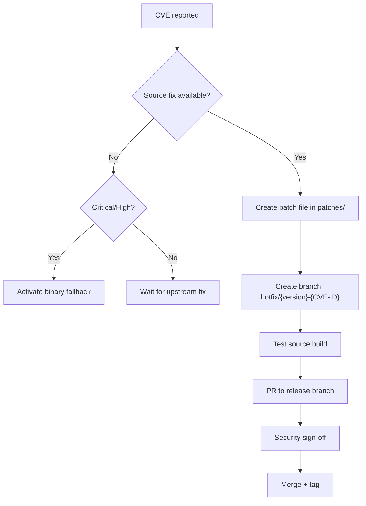

# CVE Patching

## Patch Workflow



## Creating a Patch

1. Name: `patches/0001-CVE-YYYY-NNNNN-description.patch`
2. Add required header:

```patch
# CVE:           CVE-2024-1234
# Upstream-PR:   https://github.com/upstream/pull/456
# Upstream-Fix:  not-fixed
# Keep-on-sync:  check
# Contributed:   2026-03-26
# Notes:         Drop when upgrading to >= X.Y.Z
```

3. Branch: `hotfix/{upstream_version}-CVE-2024-1234` (e.g. `hotfix/6.0.0-CVE-2024-1234`)
4. Build and test: `./build.sh && ./build.sh --scan`
5. PR targets the current release branch

## Response SLA

| Severity | CVSS | Patch SLA |
|---|---|---|
| Critical | >= 9.0 | 24 hours |
| High | 7.0 - 8.9 | 72 hours |
| Medium | 4.0 - 6.9 | Next release |
| Low | < 4.0 | Next release |
