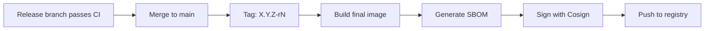

# Releasing

## Release Flow



## Steps

```bash
# Full release pipeline (build + scan + sign + push)
make release
```

Or manually:

1. Ensure release branch CI is green
2. Merge release branch to main
3. Tag: `git tag X.Y.Z-rN`
4. Build: `make build`
5. Scan: `make scan`
6. Release: runs SBOM generation, signing, and push

## Versioning

Format: `{upstream_version}-r{N}`

- `6.0.0-r1` — first revision on upstream 6.0.0
- `6.0.0-r2` — second CVE fix, same upstream
- `6.1.0-r1` — upstream bumped, revision resets

All of these must match: git tag, Docker image tag, Helm `appVersion`, `package.json` version.

## Artifacts

Each release produces:
- Container image (signed with Cosign)
- SBOM in CycloneDX format (attached as attestation)
- Scan reports in `reports/`
- `build.lock` with reproducibility metadata
