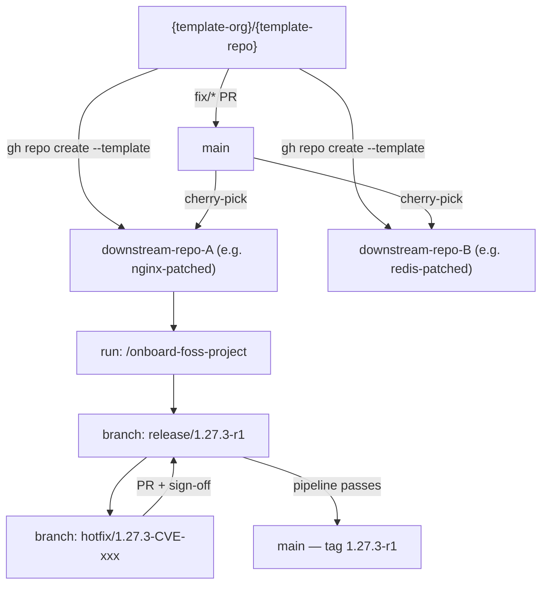

# Template Workflow

This page covers how to create a new FOSS project from this template and how to hotfix bugs — both in a downstream project and in the template itself.

---

## Overview



---

## A — Create a New FOSS Project from the Template

### Step 1 — Create the downstream repo

=== "GitHub CLI"

    ```bash
    gh repo create <your-org>/<project-name> \
      --template {template-org}/{template-repo} \
      --private
    ```

=== "GitHub UI"

    On the template repo page, click **Use this template → Create a new repository**.

### Step 2 — Clone and initialize

```bash
git clone git@github.com:<your-org>/<project-name>.git
cd <project-name>
```

!!! warning "Rename init.sh.txt before first run"
    Scripts are stored as `.sh.txt` — rename once to bootstrap.

    **macOS / Linux:**
    ```bash
    mv init.sh.txt init.sh
    chmod +x init.sh
    ./init.sh
    ```

    **Windows (Git Bash):** `chmod +x` is not supported on NTFS — use `bash` instead:
    ```bash
    mv init.sh.txt init.sh
    bash init.sh
    ```

`init.sh` translates `.sh.txt` source files to executable `.sh`, creates required directories (`patches/`, `reports/`, `docs/`, `helm/`), validates prerequisites, and auto-builds `jq` from `.tools/jsonq/` using Go if `jq` is not installed.

### Step 3 — Run the onboard skill

In Claude Code (inside the downstream repo directory):

```
/onboard-foss-project
```

The interactive wizard asks 13 questions:

| Question | Example |
|---|---|
| Repo mode | `polyrepo` |
| FOSS project name | `nginx` |
| Upstream version | `1.27.3` |
| Archive URL | `https://nginx.org/download/nginx-1.27.3.tar.gz` |
| SHA256 | `abc123...` |
| GPG signature available? | `no` |
| Language | `c` |
| License | `BSD-2-Clause` |
| Build strategy | `source` |
| Registry URL | `registry.example.com/nginx-patched` |
| Kubernetes namespace | `nginx` |

It fills all placeholders in: `package.json`, `Dockerfile`, `Dockerfile.go`, `Dockerfile.binary`, `helm/Chart.yaml`, `helm/values.yaml`, `CHANGELOG.md`, `README.md`.

### Step 4 — First release branch (created automatically)

Onboarding creates and pushes:

```bash
git checkout -b release/<upstream_version>-r1
git push origin release/<upstream_version>-r1
```

### Step 5 — Verify

```bash
./build.sh          # source build
./build.sh --scan   # security scan — must pass before any push
```

---

## B — Hotfix a Bug or CVE in a Downstream Project

Work in the **downstream repo**, not the template.

### Step 1 — Create a hotfix branch

```bash
git checkout -b hotfix/<upstream_version>-CVE-2024-XXXX
# e.g. hotfix/1.27.3-CVE-2024-XXXX
```

### Step 2 — Apply the patch

```
/cve-patch
```

Claude Code creates `patches/0001-CVE-2024-XXXX-fix-description.patch` with the required header (CVE ID, upstream PR URL, `Keep-on-sync` flag, etc.).

### Step 3 — Build and scan

```bash
./build.sh          # full source build with patch applied
./build.sh --scan   # must pass — zero unexpected Critical/High CVEs
```

### Step 4 — PR flow

```
hotfix/<version>-CVE-2024-XXXX
    ↓  PR: 1 reviewer + security sign-off
release/X.Y.Z-r2
    ↓  full pipeline passes
main ← tag X.Y.Z-r2
```

**CVE response SLA:**

| Severity | CVSS | Patch SLA |
|---|---|---|
| Critical | ≥ 9.0 | 24 hours |
| High | 7.0–8.9 | 72 hours |
| Medium | 4.0–6.9 | Next release |
| Low | < 4.0 | Next release |

---

## C — Hotfix the Template Itself

If you find a bug in `init.sh.txt`, `build.sh.txt`, a Dockerfile, a skill file, or CI config — fix it here in the **template repo**, then propagate downstream.

### Step 1 — Branch in this repo

```bash
git checkout -b fix/describe-template-bug   # or chore/description
```

### Step 2 — Edit the source files

- For scripts: edit the `.sh.txt` source, not the generated `.sh`
- For skill files: edit under `.agents/skills/`
- For CI: edit under `.cicd/`

### Step 3 — PR to main

```
fix/describe-template-bug → PR → main
```

No release branch needed — the template has no versioned images.

### Step 4 — Propagate to downstream repos

=== "Cherry-pick (small fixes)"

    ```bash
    # In each downstream repo
    git remote add template git@github.com:{template-org}/{template-repo}.git
    git fetch template
    git cherry-pick <commit-sha-from-template>
    ```

=== "Re-run skill (skill/CI fixes)"

    ```bash
    # In each downstream repo — Claude Code
    /onboard-foss-project   # or the specific skill that was updated
    ```

---

## Quick Reference

| Task | Command |
|---|---|
| Create downstream repo | `gh repo create <org>/<name> --template {template-org}/{template-repo}` |
| Bootstrap (macOS/Linux) | `mv init.sh.txt init.sh && chmod +x init.sh` |
| Bootstrap (Windows Git Bash) | `mv init.sh.txt init.sh` |
| First-run setup (macOS/Linux) | `./init.sh` |
| First-run setup (Windows Git Bash) | `bash init.sh` |
| Onboard FOSS project | `/onboard-foss-project` |
| Build (source) | `./build.sh` or `make build` |
| Security scan | `./build.sh --scan` or `make scan` |
| Apply CVE patch | `/cve-patch` |
| Release | `/release` |
| Sync upstream | `/upstream-sync` |
